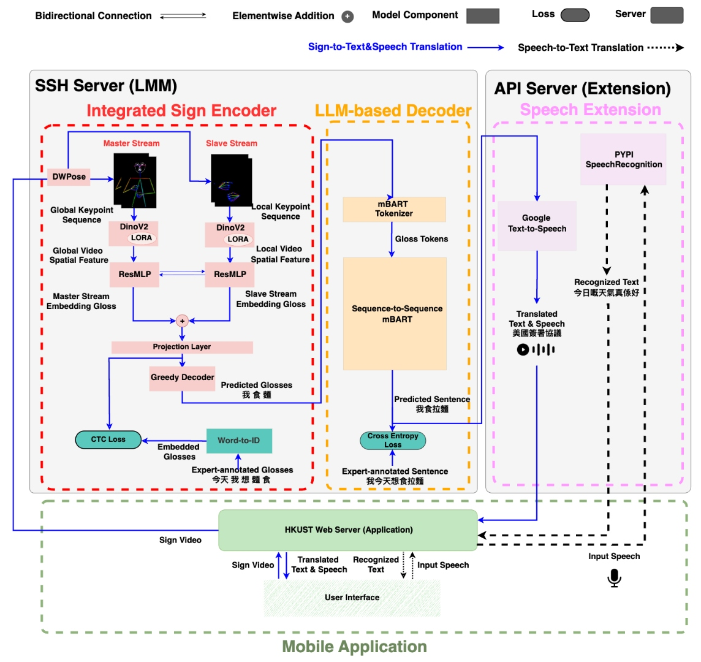
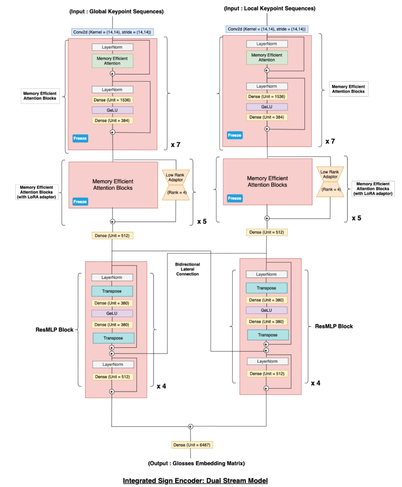

# SilenceLink: Dual-Stream HKSL Translation Model

> A portfolio release of selected model-training and inference components from **SilenceLink**, a team final-year project on Hong Kong Sign Language (HKSL) translation and bidirectional communication.

[](./ProjectSummary.pdf)


📄 **Read the technical summary:** [SilenceLink: A Large Multimodal Model--Driven Application for Hong Kong Sign Language Translation](./ProjectSummary.pdf)

## Overview

SilenceLink is a research prototype for Hong Kong Sign Language translation and bidirectional communication. The end-to-end team system combines pose-based keypoint extraction, a dual-stream visual-temporal sign encoder, gloss recognition, sequence-to-sequence text generation, speech extensions, an API layer, and a mobile application.

This repository is a deliberately limited **portfolio release**. It contains only four selected Python modules for model training and inference attributed to Wai-Shing Ng. It is not a complete or runnable release of the original SilenceLink system.

> **Project scope:** This repository is provided for educational, technical-discussion, and portfolio purposes. It is not a production translation service and is not a substitute for qualified Hong Kong Sign Language interpretation.

## Personal contribution

Wai-Shing Ng led the model-training and experimental work represented by the selected files in this repository. This included:

- Implementing the visual/sign-encoder training and inference components.
- Implementing the language-model training and inference components.
- Training the sign-language translation model.
- Designing and conducting model-configuration and ablation experiments.
- Performing quantitative model evaluation.
- Preparing the aggregate evaluation table and performance visualisations included in the technical summary.
- Preparing this public technical summary and selected-code portfolio release.

SilenceLink was completed as a **team final-year project**. Other team components included DWPose-based preprocessing, backend/API integration, speech-service integration, and a React Native/Expo mobile application. Those components are intentionally not distributed in this repository, and their implementation is not claimed here as the individual work of Wai-Shing Ng.

## Key results

The reported aggregate evaluation compares baseline and model-variant configurations on an authorised held-out HKSL evaluation setting. No source media, frame, annotation, reference sentence, or individual model-output example is included in this repository.

| Best reported configuration | BLEU-1 | BLEU-4 | ROUGE-2 F1 | Combined Score |
|---|---:|---:|---:|---:|
| DualStream Skeleton with bidirectional lateral feature exchange | **31.46** | **17.23** | **25.71** | **42.94** |

*Combined Score is calculated as BLEU-4 plus ROUGE-2 F1.*

The strongest reported configuration used separate global upper-body and local hand-oriented keypoint streams, with bidirectional lateral feature exchange between corresponding temporal encoder blocks.

## System architecture

<p align="center">
  
</p>

<p align="center">
  <em>
    End-to-end SilenceLink workflow. The complete team system connects
    keypoint preprocessing, visual-temporal sign encoding, mBART text
    generation, speech extensions, an API server, and a mobile application.
  </em>
</p>

The system is organised into three deployment layers:

- **LMM inference layer:** Performs pose/keypoint processing, visual-temporal sign encoding, CTC-based gloss prediction, mBART text generation, and sign-to-speech processing.
- **API-server layer:** Coordinates requests, file transfer, remote inference, speech-service calls, and responses between the application and model services.
- **Mobile-application layer:** Captures sign-video and speech input, displays translated or recognised text, and plays synthesised speech.

## Methodology

```text
Sign video
    ↓
DWPose-based global and local keypoint extraction
    ↓
Spatial feature extraction: DINOv2-style backbone with LoRA adaptation
    ↓
Temporal sign encoding: ResMLP blocks
    ↓
Master Stream: global upper-body keypoint sequence
Slave Stream: local hand-oriented keypoint sequence
    ↓
Bidirectional lateral feature exchange and stream fusion
    ↓
CTC-based gloss prediction and greedy decoding
    ↓
mBART sequence-to-sequence gloss-to-text generation
    ↓
Optional text-to-speech output
```

### Visual-temporal sign encoder

The visual-temporal model uses two complementary processing streams:

| Component | Role |
|---|---|
| Master Stream | Processes global upper-body keypoints to capture posture, arm movement, and broader signing context |
| Slave Stream | Processes local hand-oriented keypoints to focus on finer hand movement and hand-configuration information |
| Spatial model | Uses a pretrained DINOv2-style backbone with selective LoRA adaptation to generate spatial feature embeddings |
| Temporal model | Uses stacked ResMLP blocks to model dependencies across time |
| Lateral exchange | Allows corresponding Master and Slave Stream blocks to exchange complementary features during temporal encoding |
| Projection and decoding | Produces frame-level gloss-token logits for CTC-based training and greedy gloss decoding |

<p align="center">
  
</p>

<p align="center">
  <em>
    Dual-stream integrated sign encoder. The Master Stream processes global
    upper-body keypoints, while the Slave Stream focuses on local hand-oriented
    keypoints. Corresponding temporal blocks exchange lateral features before
    stream fusion and gloss-token projection.
  </em>
</p>

### Training and inference

The integrated sign encoder was first trained for gloss recognition using Connectionist Temporal Classification (CTC). The sign encoder was subsequently frozen while the mBART sequence-to-sequence decoder was trained for downstream gloss-to-text translation using cross-entropy supervision.

During inference, the visual model produces frame-level gloss-token probabilities. Greedy decoding selects high-probability tokens, collapses repeated tokens, and removes blank tokens. The resulting gloss sequence is processed by mBART to generate written text.

## Repository structure

```text
.
├── README.md
├── ProjectSummary.pdf
├── assets/
│   ├── end_to_end_workflow_synthetic.jpg
│   └── dual_stream_integrated_sign_encoder.jpg
├── Model-Training/
│   ├── LLM.py                 # Language-model training component
│   └── VisualModel.py         # Visual / sign-encoder training component
├── Inferencing/
│   ├── LLM.py                 # Language-model inference component
│   └── VisualModel.py         # Visual / sign-encoder inference component
├── Backend/
│   └── .gitkeep               # Placeholder only; backend code is not distributed
├── Frontend/
│   └── .gitkeep               # Placeholder only; mobile-app code is not distributed
└── docs/
    └── .gitkeep               # Reserved for public-safe documentation
```

## Code availability

The four Python modules in this repository are selected code artifacts intended to demonstrate model-training and inference implementation work. They are not provided as a complete reproducibility package.

The following materials are intentionally excluded:

- The TVB-HKSL-News Dataset, source videos, video frames, image crops, annotations, and dataset-derived qualitative examples.
- Trained model checkpoints, model weights, cached features, pose outputs, evaluation data, test data, and inference outputs.
- The complete backend/API implementation, React Native/Expo frontend, package-lock files, `node_modules`, build artifacts, uploads, temporary files, and deployment configuration.
- Server addresses, usernames, credentials, tokens, API keys, SSH keys, private URLs, and environment files.
- Code authored by other team members.
- Sign2GPT source code, model checkpoints, configuration files, datasets, and other upstream assets.

Consequently, this repository is **not expected to run out of the box**. Reproducing the complete system would require authorised data, preprocessing assets, trained weights, server infrastructure, and team-owned components that are deliberately not released here.

## Third-party acknowledgement

The project was informed by related research and open-source work, including:

- R. Wong, N. C. Camgoz, and R. Bowden. *Sign2GPT: Leveraging Large Language Models for Gloss-Free Sign Language Translation*. ICLR 2024. [Paper](https://openreview.net/forum?id=LqaEEs3UxU) · [Official repository](https://github.com/ryanwongsa/Sign2GPT)

This repository does not redistribute Sign2GPT code or assets. If a future version contains copied or modified upstream code, the relevant files must retain the applicable licence, copyright notices, attribution, and modification notices.

## Data and responsible release note

No dataset, source video, source image, dataset annotation, model checkpoint, or individual model-output example is distributed with this repository. The technical summary contains aggregate experimental metrics only.

Before reusing code, results, diagrams, or descriptions, users should review the applicable licences, third-party requirements, and institutional or team permissions.

## Author

**Wai-Shing Ng**  
MSc Candidate in Financial Technology and Data Analytics, MSc(FTDA)  
School of Computing and Data Science, The University of Hong Kong  

BEng in Computer Science  
The Hong Kong University of Science and Technology  

## Licence

No open-source licence is declared in this portfolio release. Do not assume permission to reuse, redistribute, or modify the code. A repository licence should be selected only after confirming ownership of every included file and any applicable institutional, team, data-use, or third-party obligations.